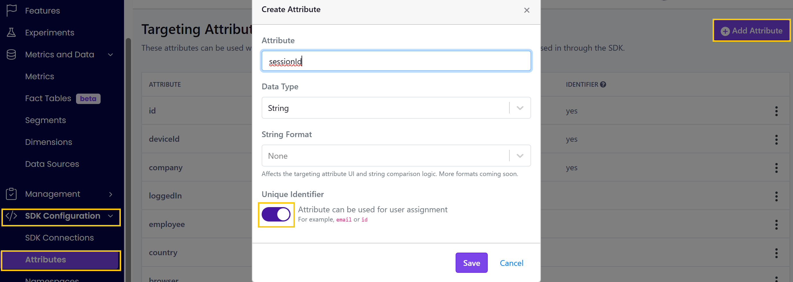
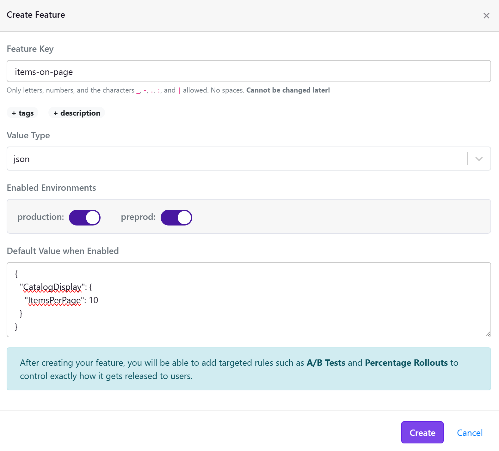
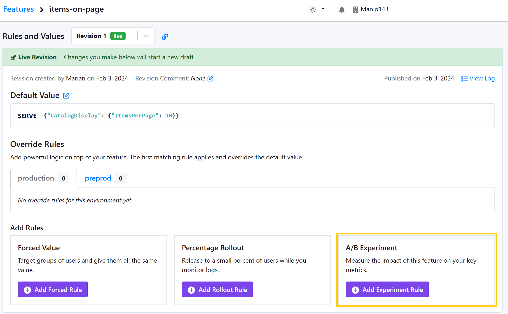
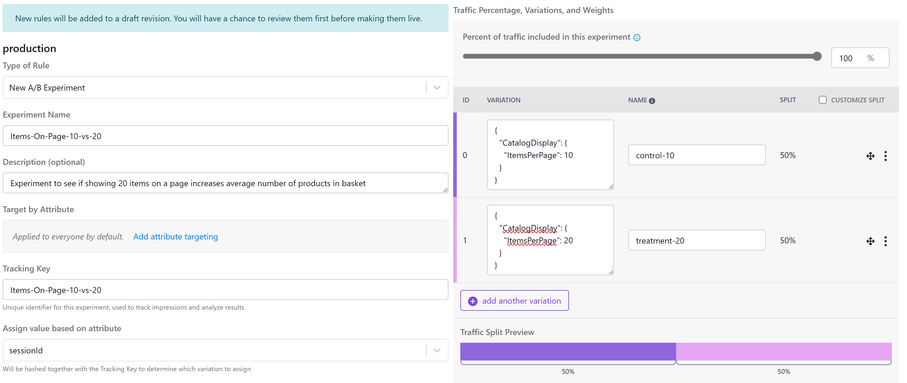
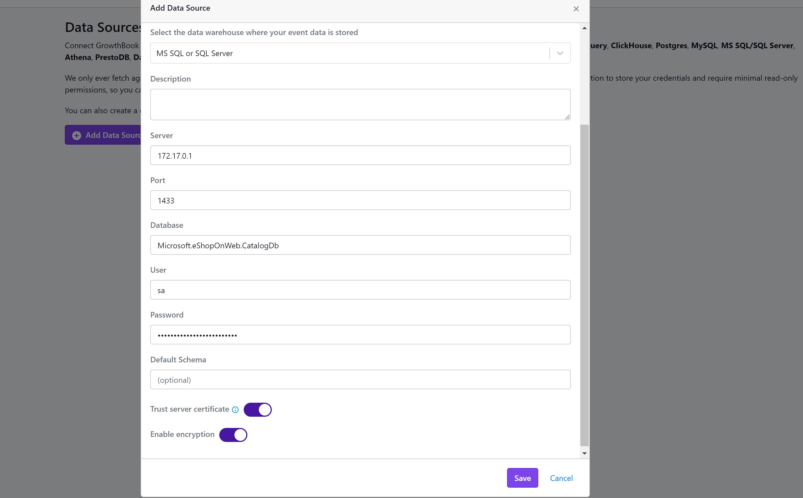
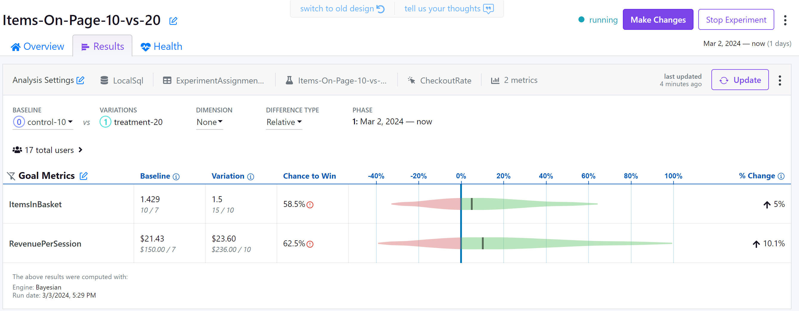
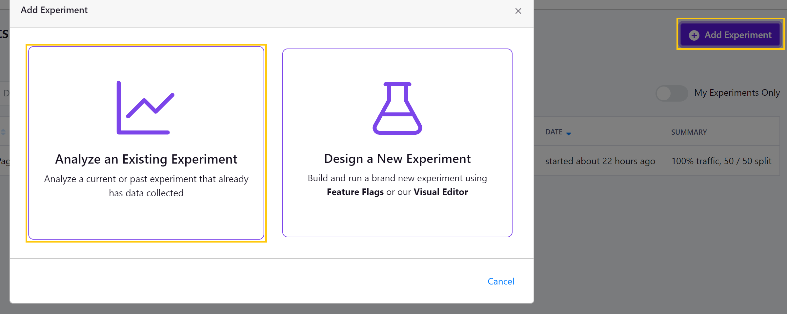
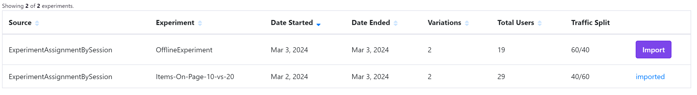

# Guide to setting up an experiment with GrowthBook

In this step-by-step guide we will look at enriching the ASP .NET Core [eShopOnWeb](https://github.com/dotnet-architecture/eShopOnWeb) demo application with experimentation capability of Excos. The demo application is quite basic but it can be used to demonstrate how to get started with experimentation.

First, let's talk about choosing the right unit of experimentation. There are two main units you'd work with on the web: session and user. The benefit of choosing a user as your experiment allocation unit is the consistency of the same user seeing the same experience across multiple sessions. If you have a page that is only available after the user signs in, prefer user based experiments. However, if the page is also available while the user is not authenticated it would be weird if it changed after they sign in. In those cases you would prefer a session based experiment. The session could be identified just by dropping a cookie with a guid identifier into the user's browser.

Code changes are published at https://github.com/manio143/eShopOnWeb/tree/excosDemo and you can find the Docker setup in `infra/experimentation`.

## Integrating demo with Contextual Options

For this demo we will try to create an experiment of increasing the number of items on the main page of the shop. Our experiment hypothesis is that when there's more items on one page then users don't need to click 'Next' that often which leads to less browsing fatigue and increases the average amount of products in the basket.

For this demo you need to install the NuGet package `Excos.Options.GrowthBook`. However, the first part is about integrating with `Microsoft.Extensions.Options.Contextual` and is actually independent of Excos.

I started off with duplicating the number of products in the catalog by adding 'Premium' items with a price 10$ more. To do so I have edited the `CatalogContextSeed.GetPreconfiguredItems()` method.

Next I needed to parameterize the number of items shown on a page. Initially that value is set to 10 and is in the `Constants` static class. It's being referenced by `Index` page. At the time of writing it was also used to `CachedCatalogViewModelService.GetCatalogItems`, but it should be replaced with the method's parameter `itemsPage`. So we have just one place to integrate Contextual Options into.

Let's create an options model for our index page

```csharp
public class CatalogDisplayOptions
{
    public int ItemsPerPage { get; set; } = Constants.ITEMS_PER_PAGE;
}
```

Next let's create a new contextual options context

```csharp
[OptionsContext]
public partial struct StoreOptionsContext
{
    public Guid SessionId { get; set; }
}
```

For this example we will inject `IContextualOptions<CatalogDisplayOptions, StoreOptionsContext>` directly into the `IndexModel` class. We will create an extension method over the `HttpContext` to get (or create) a session identifier.

```csharp
public static class ContextualExtensions
{
    public static Guid GetOrCreateExperimentSession(this HttpContext ctx)
    {
        const string cookieName = "eShopExp";
        string? sessionId;
        Guid parsedSessionId;
        if (!ctx.Request.Cookies.TryGetValue(cookieName, out sessionId))
        {
            parsedSessionId = Guid.NewGuid();
            sessionId = parsedSessionId.ToString();
            ctx.Response.Cookies.Append(cookieName, sessionId);
        }
        else
        {
            parsedSessionId = Guid.Parse(sessionId);
        }

        return parsedSessionId;
    }

    public static StoreOptionsContext ExtractStoreOptionsContext(this HttpContext ctx)
    {
        return new StoreOptionsContext { SessionId = ctx.GetOrCreateExperimentSession() };
    }
}
```

And modify the index model to retrieve the options

```csharp
public class IndexModel : PageModel
{
    private readonly ICatalogViewModelService _catalogViewModelService;
    private readonly IContextualOptions<CatalogDisplayOptions, StoreOptionsContext> _contextualOptions;

    public IndexModel(
        ICatalogViewModelService catalogViewModelService,
        IContextualOptions<CatalogDisplayOptions, StoreOptionsContext> contextualOptions)
    {
        _catalogViewModelService = catalogViewModelService;
        _contextualOptions = contextualOptions;
    }

    public required CatalogIndexViewModel CatalogModel { get; set; } = new CatalogIndexViewModel();

    public async Task OnGet(CatalogIndexViewModel catalogModel, int? pageId)
    {
        var context = HttpContext.ExtractStoreOptionsContext();
        var options = await _contextualOptions.GetAsync(context, default);

        CatalogModel = await _catalogViewModelService.GetCatalogItems(pageId ?? 0, options.ItemsPerPage, catalogModel.BrandFilterApplied, catalogModel.TypesFilterApplied);
    }
}
```

## Adding Excos as a source of contextual options

Excos library is a layer on top Contextual Options which provides a Feature/Experiment definition schema. We will use it to populate `CatalogDisplayOptions`. So we're going to add the following line to `Program.cs`

```csharp
builder.Services.ConfigureExcos<CatalogDisplayOptions>("CatalogDisplay");
```

The string parameter to `ConfigureExcos` is the configuration section name that will be used to bind configuration to this options instance. When we set up the experiment values later this section name will be used.

Optionally, before integrating with Growthbook, you can test the Excos feature definition is working by describing a feature rollout using builder API:

```csharp
builder.Services.BuildFeature("TestRollout")
    .Rollout(
        75 /*percent*/,
        """{ "CatalogDisplay": { "ItemsPerPage": 20 } }""",
        allocationUnit: nameof(StoreOptionsContext.SessionId))
    .Save();
```

## Configuring connection to GrowthBook instance

You can [self-host](https://docs.growthbook.io/self-host) GrowthBook with Docker or use the free tier of their cloud offering to get started.

There are two ways to configure GrowthBook integration:

### Option 1: Using Host Builder (Recommended)

This approach sets up both configuration and contextual options with a shared feature provider:

```csharp
builder.Host.ConfigureExcosWithGrowthBook(options =>
{
    options.ApiHost = new Uri("http://localhost:3100");
    options.ClientKey = "sdk-####";
});
```

This single call:
- Adds GrowthBook features as a configuration source (for `IConfiguration` binding)
- Registers the feature provider for contextual options (for `IContextualOptions<T>`)
- Uses a single shared provider instance for both

### Option 2: Using Dependency Injection

For scenarios requiring DI-managed HTTP clients and logging:

```csharp
builder.Services.ConfigureExcosWithGrowthBook(options =>
{
    options.ApiHost = new Uri("http://localhost:3100");
    options.ClientKey = "sdk-####";
});
```

Or with configuration binding:

```csharp
builder.Services.ConfigureExcosWithGrowthBook(options =>
{
    builder.Configuration.GetSection("GrowthBook").Bind(options);
});
```

With this approach, add your settings to `appsettings.json`:

```json
  "GrowthBook": {
    "ApiHost": "http://localhost:3100",
    "ClientKey": "sdk-####"
  }
```

### Getting your SDK Connection

Visit your GrowthBook instance and create a new connection - go to "SDK Configuration" > "SDK Connections", click the Add button, provide a friendly name, choose "Other" SDK type and the target environment. Copy the connection details.

## Setting up the experiment in GrowthBook

First, we're going to add `SessionId` as an identifier to match our options context. Go to "SDK Configuration" > "Attributes" and add a new attribute.



Go to "Features" tab in GrowthBook and create a new feature definition. For the value type select JSON. Excos generally expects JSON settings in the same format as used by `appsettings.json` with the `Microsoft.Extensions.Configuration` framework.

Default value:

```json
{
  "CatalogDisplay": {
    "ItemsPerPage": 10
  }
}
```



Next we're going to create an experiment. Scroll down on the feature page and click the Add Experiment Rule button.



Try use clear and descriptive names for your experiments. In this example I use `Items-On-Page-10-vs-20` as the name to signal what the experiment will change. The tracking key is a unique identifier which we will later add to telemetry to signal that the session was part of this experiment.



Excos supports most basic GrowthBook attribute filters (targeting) - file an issue if you see something doesn't work. We're not going to use them in this demo, but generally it's quite easy to add an attribute to your options context.

> [!WARNING]
> Make sure to click "Review and Publish" after creating the experiment for the changes to become available from the API.

## Saving experiment results

In this demo we will create a new telemetry pipeline for the purpose of processing the results with GrowthBook. First when a new session is created we will log the experiment metadata to note which experiment variation was shown. When the user checks out we will log the details of their basket and map that to the session ID. This will later allow GrowthBook's statistical engine to process the data and tell us if the change of items per page had actually influenced the desired metric.

We'll reuse the EntityFramework set up of the eShop.

Let's start by defining the service interface we will call into. We can place it in ApplicationCore/Interfaces.

```csharp
public interface IExperimentationService
{
    Task SaveExperimentAssignmentAsync(Guid sessionId, string experimentName, string variantId);
    Task MapBasketToSessionAsync(int basketId, Guid sessionId);
}
```

Next we will create a code-first EF context with two tables and place it under Infrastructure/Logging.

```csharp
public class ExperimentationContext : DbContext
{
    #pragma warning disable CS8618 // Required by Entity Framework
    public ExperimentationContext(DbContextOptions<ExperimentationContext> options) : base(options) {}

    public DbSet<ExperimentationAssignment> Assignments { get; set; }
    public DbSet<BasketSessionMapping> BasketSessionMappings { get; set; }

    protected override void OnModelCreating(ModelBuilder builder)
    {
        base.OnModelCreating(builder);
    }
}
```

The first table is about assigning an experiment variant to a session ID. We also will want to include a date when this session was started.

```csharp
[Table("Assignment", Schema = "exp")]
public class ExperimentationAssignment
{
    [Key]
    public Guid SessionId { get; set; }

    [Required]
    [Column(TypeName = "nvarchar(128)")]
    public string VariantId { get; set; }

    public DateTime Timestamp { get; set; } = DateTime.UtcNow;
}
```

The second table is simpler and just maps a basket ID created during checkout to the session ID. It could happen that the user performs multiple checkouts within the same session, or that there isn't any checkout in the session.

```csharp
[Table("BasketSessionMapping", Schema = "exp")]
[PrimaryKey(nameof(SessionId), nameof(BasketId))]
public class BasketSessionMapping
{
    public Guid SessionId { get; set; }

    public int BasketId { get; set; }
}
```

With that in place we can implement our `ExperimentationService` class which basically will be inserting rows into the table. For the assignment we will check if the record doesn't exist already because we can visit Index page multiple times and try to log the assignment for the same session multiple times. For the basket mapping we only need to execute this once, because the checkout process should be atomic.

```csharp
public class ExperimentationService : IExperimentationService
{
    private readonly ExperimentationContext _dbContext;
    private readonly /*Excos.Options.*/IFeatureEvaluation _featureEvaluation;

    public ExperimentationService(ExperimentationContext dbContext, IFeatureEvaluation featureEvaluation)
    {
        _dbContext = dbContext;
        _featureEvaluation = featureEvaluation;
    }

    public async Task SaveExperimentAssignmentAsync(StoreOptionsContext context)
    {
        // check if we already have an assignment for this session
        var assignment = await _dbContext.Assignments
            .Where(a => a.SessionId == context.SessionId)
            .FirstOrDefaultAsync();

        if (assignment == null)
        {
            foreach (var variant in await _featureEvaluation.EvaluateFeaturesAsync(context, default(CancellationToken)))
            {
                assignment = new ExperimentationAssignment
                {
                    SessionId = context.SessionId,
                    VariantId = variant.Id
                };

                _dbContext.Assignments.Add(assignment);
            }

            await _dbContext.SaveChangesAsync();
        }
    }

    public async Task MapBasketToSessionAsync(int basketId, Guid sessionId)
    {
        var mapping = new BasketSessionMapping
        {
            BasketId = basketId,
            SessionId = sessionId
        };

        _dbContext.BasketSessionMappings.Add(mapping);
        await _dbContext.SaveChangesAsync();
    }
}
```

We need to now wire up those classes with the dependency injection. For the DbContext we will follow Infrastructure/Dependencies.cs and add experimentation context to be used with the same database as the orders.

```csharp
services.AddDbContext<ExperimentationContext>(c =>
   c.UseSqlServer(configuration.GetConnectionString("CatalogConnection")));
```

And a simple `builder.Services.AddScoped<IExperimentationService, ExperimentationService>();` in `Program.cs`.

With that in place, let's add the experimentation service to Index.cshtml.cs and read the Excos FeatureMetadata to learn about what experiment variants have been applied.

```csharp
public class CatalogDisplayOptions
{
    public int ItemsPerPage { get; set; } = Constants.ITEMS_PER_PAGE;
}

// Index.cshtml.cs
public async Task OnGet(CatalogIndexViewModel catalogModel, int? pageId)
{
    var context = HttpContext.ExtractStoreOptionsContext();
    var options = await _contextualOptions.GetAsync(context, default);

    // Add this call to experimentation service
    _experimentationService.SaveExperimentAssignmentAsync(context);

    CatalogModel = await _catalogViewModelService.GetCatalogItems(pageId ?? 0, options.ItemsPerPage, catalogModel.BrandFilterApplied, catalogModel.TypesFilterApplied);
}
```

And then we need to map the basket ID to the session so we will add experimentation service to Checkout.cshtml.cs

```csharp
var updateModel = items.ToDictionary(b => b.Id.ToString(), b => b.Quantity);
await _basketService.SetQuantities(BasketModel.Id, updateModel);
await _orderService.CreateOrderAsync(BasketModel.Id, new Address("123 Main St.", "Kent", "OH", "United States", "44240"));
// add this call to experimentation service
await _experimentationService.MapBasketToSessionAsync(BasketModel.Id, HttpContext.GetOrCreateExperimentSession());
await _basketService.DeleteBasketAsync(BasketModel.Id);
```

Before we can start running the service we also need to create the new tables in the database. To do so we will create a new migration. Run these commands in the Web project directory - similarly to how eShopOnWeb docs say to initialize the other two db contexts.

```
dotnet ef migrations add ExpInitial -c ExperimentationContext -o Logging/Migrations -p ../Infrastructure/Infrastructure.csproj -s Web.csproj
```

Remove any references to CatalogDbContext and its models from the migration and snapshot.

```
dotnet ef database update -c ExperimentationContext -p ../Infrastructure/Infrastructure.csproj -s Web.csproj
```

If everything worked out you should be able to now run through some checkouts and collect telemetry in your database.

## Analyzing the results in GrowthBook

We've orchestrated our code to fetch experiments from GrowthBook, use their configuration to render UI to the user and then log the user behavior in the database. Now it's time to feed this data back to GrowthBook for analysis.

Let's start by connecting GrowthBook to our SQL Server instance. Go to "Metrics and Data" > "Data Sources" and add a new one. I'm using going with custom setup and pointing it at the SQL server running from Docker.



With that we will redefine the Identifier Type as `sessionid` and create the experiment assignment query called `ExperimentAssignmentBySession`. In the SQL below I'm doing a bit of a manipulation to extract experiment label and variant id for GrowthBook. This is due to the fact that Excos expects variant Ids to be uniquely identifying both the feature and variant. A GrowthBook experiment is saved as a VariantId `{tracking-label}:{treatmentId}`. This query will allow you to use both GrowthBook experiments and other Excos experiments using the configuration provider.

```sql
SELECT
  SessionId as sessionid,
  Timestamp as timestamp,
  SUBSTRING(VariantId, 1, (GREATEST(1, CHARINDEX(':', VariantId)) - 1)) as experiment_id,
  SUBSTRING(VariantId, GREATEST(1, CHARINDEX(':', VariantId) + 1), 128) as variation_id
FROM [exp].[Assignment]
```

If you add dimensions/attributes to your OptionsContext you need to log these into the assignment table as well and select them in the query.

Next we will define 3 metrics:
* `CheckoutRate` (Binomial) - how many sessions resulted in a checkout
    ```sql
    SELECT
        a.SessionId as sessionid,
        o.OrderDate as timestamp,
        o.Id as orderid
    FROM [exp].[Assignment] a
    JOIN [exp].[BasketSessionMapping] s ON (a.SessionId = s.SessionId)
    JOIN [dbo].[Orders] o ON (s.BasketId = o.Id)
    ```
* `ItemsInBasket` (Count) - how many items there was in a basket on checkout
    ```sql
    SELECT
        a.SessionId as sessionid,
        COALESCE(o.OrderDate, a.Timestamp) as timestamp,
        o.Id as orderid,
        COALESCE(SUM(oi.Units), 0) as value
    FROM [exp].[Assignment] a
    LEFT JOIN [exp].[BasketSessionMapping] s ON (a.SessionId = s.SessionId)
    LEFT JOIN [dbo].[Orders] o ON (s.BasketId = o.Id)
    LEFT JOIN [dbo].[OrderItems] oi ON (o.Id = oi.OrderId)
    GROUP BY
        a.SessionId, a.Timestamp, o.OrderDate, o.Id
    ```
* `Revenue` - how much was the basket worth on checkout
    ```sql
    SELECT
        a.SessionId as sessionid,
        COALESCE(o.OrderDate, a.Timestamp) as timestamp,
        o.Id as orderid,
        COALESCE(SUM(oi.UnitPrice * oi.Units), 0) as value
    FROM [exp].[Assignment] a
    LEFT JOIN [exp].[BasketSessionMapping] s ON (a.SessionId = s.SessionId)
    LEFT JOIN [dbo].[Orders] o ON (s.BasketId = o.Id)
    LEFT JOIN [dbo].[OrderItems] oi ON (o.Id = oi.OrderId)
    GROUP BY
        a.SessionId, a.Timestamp, o.OrderDate, o.Id
    ```

On the Behavior tab in the advanced settings I will mark minimum sample size as 10 for this demo to see any results, but normally you want to get 100-300 samples before starting to make any judgement on the data.

With the metrics added, let's move onto the experiment. Select the experiment Items-On-Page-10-vs-20 and click on the Results tab. Select the data source - the one we just configured, select `CheckoutRate` as the Activation Metric and in the Goal Metrics select the two other metrics. Click Update button to pull in the data.

After collecting some data I can see for example the following result of my experiment so far:



## Using only GrowthBook statistical engine with Excos

If you don't want to take a dependency on GrowthBook API as a source of settings, you can still use Excos to define your features and experiments. Excos can work with any ASP.NET compatible configuration provider or you can just put your experiment in code configuration for offline deployments.

I've created a simple A/A test (meaning no difference between control and treatment):

```csharp
builder.Services.BuildFeature("OfflineExperiment")
    .ABExperiment(
        """{ "CatalogDisplay": { "ItemsPerPage": 10 } }""",
        """{ "CatalogDisplay": { "ItemsPerPage": 10 } }""", // no change A/A experiment
        allocationUnit: nameof(StoreOptionsContext.SessionId))
    .Save();
```

I've collected some data and then went into GrowthBook. If you haven't connected to a data source, follow the instructions in the section above. Go to the experiment page and create a new experiment.



You may need to click the "Refresh List" button to pull data from the database. Also there will be some deafult filters searching for the experiments with minimum number of users, you can clear those out. Import the experiment.



You may need to adjust % split to be 50/50 - it's initially inferred from the already collected samples which may not be an even split. The `ID` of the variants is important and must match Excos configuration.

Add the metrics, load data for analysis and that's it.
